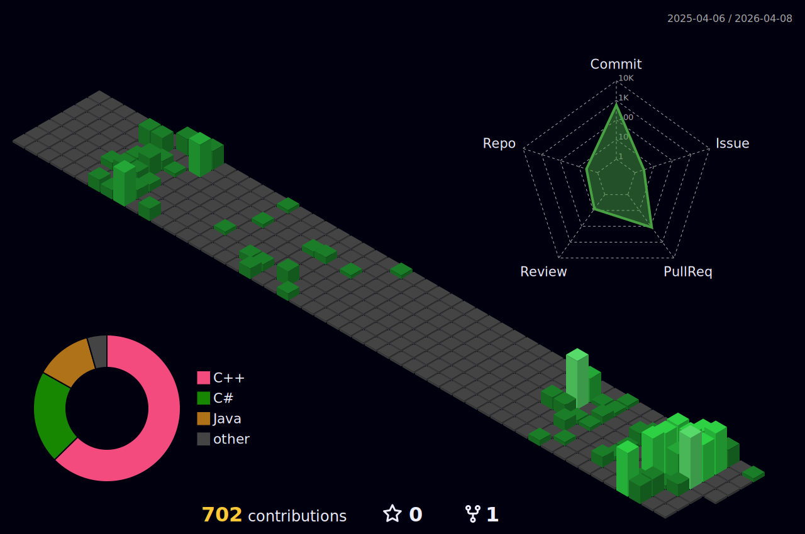

<h3 align="center">안녕하세요, 양현석입니다 👾</h3>

  소프트웨어학을 전공하는 학부생이며,
  <b>게임 개발 · 그래픽스(Real-time Rendering)</b>를 중심으로 공부하고 있습니다.  
  인디 게임 개발 팀인 <b>TeamHJD</b>의 Co-founder입니다.

 

  
  Developable

 

<!-- Languages -->

 

<!-- Game / Graphics -->

 

<!-- Tools -->

 

  
  Now Studying

 

<!-- Language / Engine -->

 

<!-- Graphics / Platform -->

  

  
    

  

  

 

<h4 align="center">Contact</h4>

 

<b>Personal</b>

 

<b>Team · TeamHJD</b>

 

