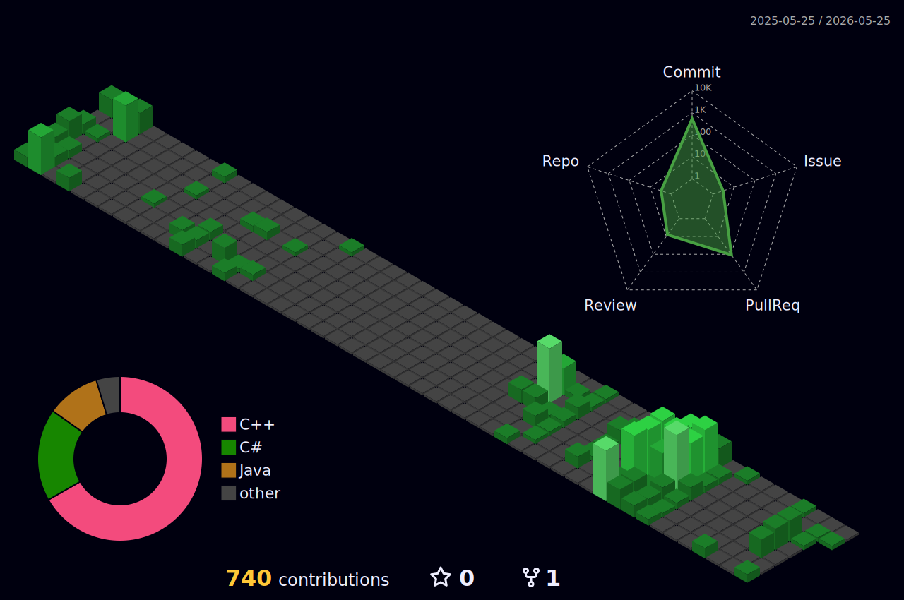

<h3 align="center">Hi, I'm Hyunseok Yang 👾</h3>

  Software Engineering undergraduate 
  Focused on <b>Game Development · Real-time Rendering</b>  

  <i>"Building game systems from low-level graphics to engine architecture"</i>

 

🚀 Tech Stack

 

<!-- Languages -->

 

<!-- Game / Graphics -->

 

<!-- Tools -->

 

📚 Currently Learning

 

 

 

💼 Experience

 

<ul>
  <li><b>Sejong University</b> — B.S. in Software Engineering (2021 ~ )</li>
  <li><b>Krafton Jungle - Game Tech Lab</b> (2026.03 ~ )</li>
  <li><b>TeamHJD</b> — Indie Game Development Team (2025.12 ~ )</li>
</ul>

  

  
    

  

 

<h4 align="center">Contact</h4>

 

<b>Personal</b>

 

<b>Team · TeamHJD</b>

 

